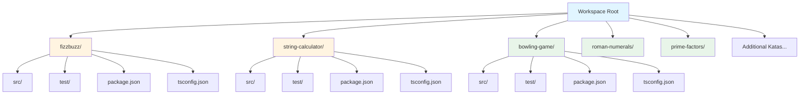
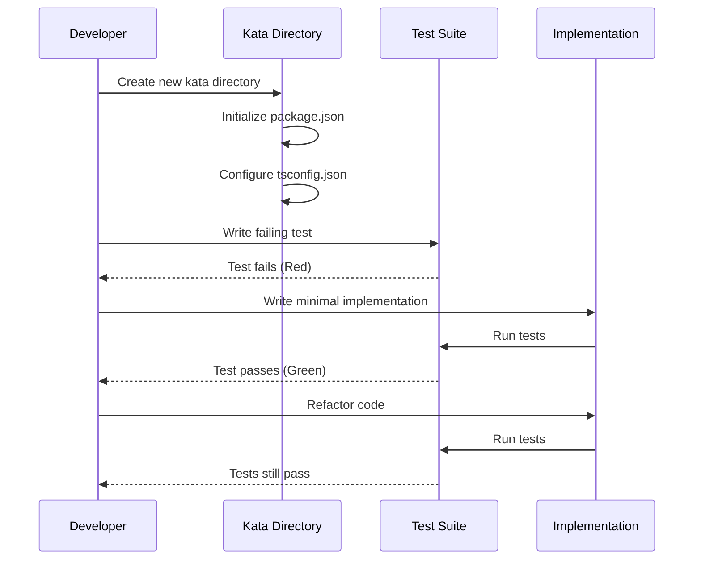

# Design Document: TDD Katas Collection

## Overview

The TDD Katas Collection feature expands the existing workspace with additional Test-Driven Development practice exercises. Currently, the workspace contains two katas (fizzbuzz and string-calculator), each in isolated directories with TypeScript, Vitest testing framework, and pnpm package management. This design establishes a standardized structure and tooling approach for adding new katas while maintaining consistency across the collection. The goal is to create a scalable, maintainable collection of TDD exercises that follow identical patterns for setup, testing, and implementation.

## Architecture



## Main Algorithm/Workflow



## Components and Interfaces

### Component 1: Kata Directory Structure

**Purpose**: Provides isolated, self-contained environment for each TDD kata exercise

**Structure**:
```typescript
interface KataDirectory {
  name: string;              // kebab-case kata name
  src: SourceDirectory;      // implementation files
  test: TestDirectory;       // test files
  packageJson: PackageConfig;
  tsconfig: TypeScriptConfig;
  nodeModules: Dependencies; // installed via pnpm
}
```

**Responsibilities**:
- Isolate kata implementation from other katas
- Maintain consistent file structure across all katas
- Provide independent dependency management
- Enable parallel development of multiple katas

### Component 2: Package Configuration

**Purpose**: Standardizes dependencies, scripts, and package manager across all katas

**Interface**:
```typescript
interface PackageConfig {
  name: string;
  version: string;
  scripts: {
    test: string;        // "vitest"
    "test:watch": string; // "vitest --watch"
  };
  packageManager: string; // "pnpm@10.32.1"
  devDependencies: {
    "@types/node": string;
    "typescript": string;
    "vitest": string;
  };
}
```

**Responsibilities**:
- Define test execution commands
- Specify TypeScript and Vitest versions
- Lock package manager version
- Provide consistent development experience

### Component 3: TypeScript Configuration

**Purpose**: Ensures consistent TypeScript compilation settings across all katas

**Interface**:
```typescript
interface TypeScriptConfig {
  compilerOptions: {
    target: "ESNext";
    module: "NodeNext";
    moduleResolution: "NodeNext";
    strict: true;
    types: ["vitest/globals"];
    esModuleInterop: true;
  };
}
```

**Responsibilities**:
- Enable strict type checking
- Configure modern ES module resolution
- Integrate Vitest global types
- Ensure consistent compilation behavior

### Component 4: Test Suite

**Purpose**: Defines test cases following TDD red-green-refactor cycle

**Interface**:
```typescript
interface TestSuite {
  describe(name: string, tests: () => void): void;
  it(description: string, test: () => void): void;
  expect<T>(actual: T): Assertion<T>;
}

interface Assertion<T> {
  toBe(expected: T): void;
  toEqual(expected: T): void;
  toThrow(message?: string): void;
}
```

**Responsibilities**:
- Organize tests into logical groups
- Provide clear test descriptions
- Assert expected behavior
- Report test failures with helpful messages

### Component 5: Implementation Module

**Purpose**: Contains the kata solution following TDD principles

**Interface**:
```typescript
// Generic kata module structure
export interface KataModule {
  // Primary function(s) being tested
  [functionName: string]: (...args: any[]) => any;
}
```

**Responsibilities**:
- Export testable functions
- Implement minimal code to pass tests
- Follow single responsibility principle
- Maintain clean, refactored code

## Data Models

### Model 1: Kata Metadata

```typescript
interface KataMetadata {
  name: string;           // e.g., "bowling-game"
  displayName: string;    // e.g., "Bowling Game"
  difficulty: "beginner" | "intermediate" | "advanced";
  description: string;
  learningObjectives: string[];
  estimatedTime: number;  // minutes
  source?: string;        // URL to kata origin
}
```

**Validation Rules**:
- name must be kebab-case
- displayName must be non-empty
- difficulty must be one of three levels
- estimatedTime must be positive integer

### Model 2: Test Case

```typescript
interface TestCase {
  description: string;
  input: any;
  expected: any;
  shouldThrow?: boolean;
  errorMessage?: string;
}
```

**Validation Rules**:
- description must be clear and specific
- input and expected must be defined
- if shouldThrow is true, errorMessage should be provided

## Core Interfaces/Types

```typescript
// Kata generator configuration
interface KataGeneratorConfig {
  name: string;
  template: "basic" | "advanced";
  includeReadme: boolean;
}

// Common kata patterns
type KataFunction<I, O> = (input: I) => O;
type KataValidator<T> = (value: T) => boolean;
type KataTransformer<I, O> = (input: I) => O;
```

## Key Functions with Formal Specifications

### Function 1: createKataDirectory()

```typescript
function createKataDirectory(config: KataGeneratorConfig): void
```

**Preconditions:**
- `config.name` is non-empty and follows kebab-case format
- `config.name` does not conflict with existing directory
- Workspace root is writable

**Postconditions:**
- New directory created at workspace root with name `config.name`
- Directory contains: src/, test/, package.json, tsconfig.json
- package.json has correct name field matching `config.name`
- All configuration files are valid JSON/JSONC

**Loop Invariants:** N/A (no loops in this function)

### Function 2: initializePackageJson()

```typescript
function initializePackageJson(kataName: string, targetDir: string): void
```

**Preconditions:**
- `kataName` is non-empty string
- `targetDir` exists and is writable
- No package.json exists at `targetDir/package.json`

**Postconditions:**
- package.json created at `targetDir/package.json`
- File contains valid JSON with required fields: name, version, scripts, devDependencies
- scripts.test equals "vitest"
- scripts["test:watch"] equals "vitest --watch"
- packageManager field specifies pnpm version

**Loop Invariants:** N/A

### Function 3: generateTestTemplate()

```typescript
function generateTestTemplate(kataName: string, functionName: string): string
```

**Preconditions:**
- `kataName` is non-empty string
- `functionName` is valid TypeScript identifier

**Postconditions:**
- Returns valid TypeScript test file content
- Content includes Vitest imports (describe, it, expect)
- Content includes import statement for function from ../src/
- Content includes at least one describe block
- Content includes at least one it block with expect assertion

**Loop Invariants:** N/A

## Algorithmic Pseudocode

### Main Kata Creation Algorithm

```typescript
// Algorithm: Create New Kata
// Input: kataName (string), template (string)
// Output: void (side effect: creates kata directory structure)

function createNewKata(kataName: string, template: string = "basic"): void {
  // Precondition: kataName is valid kebab-case
  assert(isValidKebabCase(kataName));
  assert(!directoryExists(kataName));
  
  // Step 1: Create directory structure
  const kataDir = createDirectory(kataName);
  createDirectory(`${kataDir}/src`);
  createDirectory(`${kataDir}/test`);
  
  // Step 2: Initialize configuration files
  writeFile(
    `${kataDir}/package.json`,
    generatePackageJson(kataName)
  );
  
  writeFile(
    `${kataDir}/tsconfig.json`,
    generateTsConfig()
  );
  
  // Step 3: Create template files
  const mainFunctionName = toCamelCase(kataName);
  
  writeFile(
    `${kataDir}/src/${kataName}.ts`,
    generateImplementationTemplate(mainFunctionName)
  );
  
  writeFile(
    `${kataDir}/test/${kataName}.test.ts`,
    generateTestTemplate(kataName, mainFunctionName)
  );
  
  // Step 4: Install dependencies
  executeCommand(`cd ${kataDir} && pnpm install`);
  
  // Postcondition: All files created and dependencies installed
  assert(fileExists(`${kataDir}/package.json`));
  assert(fileExists(`${kataDir}/tsconfig.json`));
  assert(directoryExists(`${kataDir}/node_modules`));
}
```

**Preconditions:**
- kataName is valid kebab-case string
- kataName does not conflict with existing directory
- pnpm is installed and available in PATH
- Workspace root is writable

**Postconditions:**
- New kata directory created with complete structure
- All configuration files are valid and consistent
- Dependencies installed successfully
- Test file can be executed with `pnpm test`

**Loop Invariants:** N/A (sequential operations, no loops)

### Validation Algorithm

```typescript
// Algorithm: Validate Kata Name
// Input: name (string)
// Output: isValid (boolean)

function isValidKebabCase(name: string): boolean {
  // Check basic structure
  if (name === null || name === undefined || name === "") {
    return false;
  }
  
  // Check kebab-case pattern: lowercase letters, numbers, hyphens
  // Must start with letter, cannot end with hyphen
  const kebabPattern = /^[a-z][a-z0-9]*(-[a-z0-9]+)*$/;
  
  if (!kebabPattern.test(name)) {
    return false;
  }
  
  // Check for reserved names
  const reserved = ["node_modules", "dist", "build", ".git", ".kiro"];
  if (reserved.includes(name)) {
    return false;
  }
  
  // All validations passed
  return true;
}
```

**Preconditions:**
- name parameter is provided (may be null/undefined/empty, but parameter exists)

**Postconditions:**
- Returns boolean indicating validity
- true if and only if name is valid kebab-case and not reserved
- No side effects on input parameter

**Loop Invariants:** N/A (no loops, only pattern matching)

## Example Usage

```typescript
// Example 1: Create a new kata with basic template
createNewKata("bowling-game", "basic");

// Example 2: Validate kata name before creation
const kataName = "roman-numerals";
if (isValidKebabCase(kataName)) {
  createNewKata(kataName);
} else {
  throw new Error(`Invalid kata name: ${kataName}`);
}

// Example 3: Generate test template for existing kata
const testContent = generateTestTemplate("prime-factors", "primeFactors");
writeFile("prime-factors/test/prime-factors.test.ts", testContent);

// Example 4: Complete workflow
const newKata = "leap-year";
if (!directoryExists(newKata) && isValidKebabCase(newKata)) {
  createNewKata(newKata);
  console.log(`Kata '${newKata}' created successfully`);
  console.log(`Run: cd ${newKata} && pnpm test:watch`);
}
```

## Correctness Properties

### Property 1: Directory Isolation
**∀ kata ∈ Katas**: Each kata directory is self-contained with no shared dependencies outside node_modules

```typescript
// For all katas, verify isolation
function verifyKataIsolation(kataName: string): boolean {
  const kataDir = `./${kataName}`;
  return (
    directoryExists(`${kataDir}/src`) &&
    directoryExists(`${kataDir}/test`) &&
    fileExists(`${kataDir}/package.json`) &&
    fileExists(`${kataDir}/tsconfig.json`) &&
    !hasExternalDependencies(kataDir)
  );
}
```

### Property 2: Configuration Consistency
**∀ kata ∈ Katas**: All katas use identical TypeScript and Vitest configurations

```typescript
// For all katas, verify consistent configuration
function verifyConfigConsistency(kataName: string): boolean {
  const tsconfig = readTsConfig(`${kataName}/tsconfig.json`);
  const pkg = readPackageJson(`${kataName}/package.json`);
  
  return (
    tsconfig.compilerOptions.strict === true &&
    tsconfig.compilerOptions.target === "ESNext" &&
    pkg.devDependencies.vitest !== undefined &&
    pkg.scripts.test === "vitest"
  );
}
```

### Property 3: Test Executability
**∀ kata ∈ Katas**: Tests can be executed independently without external setup

```typescript
// For all katas, verify tests are executable
function verifyTestExecutability(kataName: string): boolean {
  const result = executeCommand(`cd ${kataName} && pnpm test`);
  return result.exitCode === 0 || result.exitCode === 1; // 0=pass, 1=fail (both valid)
}
```

### Property 4: Naming Convention
**∀ kata ∈ Katas**: Directory name matches package.json name and follows kebab-case

```typescript
// For all katas, verify naming consistency
function verifyNamingConvention(kataName: string): boolean {
  const pkg = readPackageJson(`${kataName}/package.json`);
  return (
    isValidKebabCase(kataName) &&
    pkg.name === kataName
  );
}
```

## Error Handling

### Error Scenario 1: Duplicate Kata Name

**Condition**: Attempting to create kata with name that already exists
**Response**: Throw descriptive error before any file operations
**Recovery**: User must choose different name or delete existing kata

```typescript
if (directoryExists(kataName)) {
  throw new Error(
    `Kata '${kataName}' already exists. Choose a different name or remove existing directory.`
  );
}
```

### Error Scenario 2: Invalid Kata Name

**Condition**: Kata name doesn't follow kebab-case convention
**Response**: Throw validation error with examples of valid names
**Recovery**: User must provide valid kebab-case name

```typescript
if (!isValidKebabCase(kataName)) {
  throw new Error(
    `Invalid kata name '${kataName}'. Must be kebab-case (e.g., 'bowling-game', 'roman-numerals').`
  );
}
```

### Error Scenario 3: Dependency Installation Failure

**Condition**: pnpm install fails due to network or configuration issues
**Response**: Log error details and provide troubleshooting steps
**Recovery**: User must resolve pnpm/network issues and retry

```typescript
try {
  executeCommand(`cd ${kataDir} && pnpm install`);
} catch (error) {
  console.error(`Failed to install dependencies for ${kataName}`);
  console.error(`Error: ${error.message}`);
  console.error(`Try: cd ${kataName} && pnpm install`);
  throw error;
}
```

### Error Scenario 4: File System Permission Error

**Condition**: Insufficient permissions to create directories or files
**Response**: Throw error with permission details
**Recovery**: User must fix file system permissions

```typescript
try {
  createDirectory(kataDir);
} catch (error) {
  throw new Error(
    `Permission denied: Cannot create directory '${kataDir}'. Check file system permissions.`
  );
}
```

## Testing Strategy

### Unit Testing Approach

Each kata implementation should have comprehensive unit tests covering:
- Happy path scenarios with typical inputs
- Edge cases (empty inputs, boundary values, special characters)
- Error conditions (invalid inputs, negative numbers, null/undefined)
- Multiple test cases per requirement to ensure thorough coverage

Test organization:
- One describe block per function or logical grouping
- Clear, descriptive test names following pattern: "returns X when Y"
- Arrange-Act-Assert structure within each test
- No test interdependencies (each test runs independently)

Coverage goals:
- 100% line coverage for kata implementations
- All branches tested (if/else, switch cases, ternaries)
- All error paths verified with expect().toThrow()

### Property-Based Testing Approach

For katas with mathematical or algorithmic properties, use property-based testing to verify invariants across many generated inputs.

**Property Test Library**: fast-check (TypeScript/JavaScript property-based testing library)

Example properties to test:
- Idempotency: f(f(x)) === f(x) for certain functions
- Commutativity: f(a, b) === f(b, a) where applicable
- Inverse operations: decode(encode(x)) === x
- Range constraints: output always within expected bounds
- Type preservation: output type matches expected type for all inputs

Implementation approach:
- Add fast-check as dev dependency to katas requiring property tests
- Create separate property test files (e.g., kata-name.property.test.ts)
- Use fc.assert with fc.property for property definitions
- Generate appropriate input types with fc.string(), fc.integer(), fc.array(), etc.

### Integration Testing Approach

Integration tests are generally not required for individual katas since they are self-contained exercises. However, for the kata collection as a whole:

- Verify all katas can be installed and tested in sequence
- Test kata generator/scaffolding tools if implemented
- Validate consistency across all kata configurations
- Ensure no naming conflicts or dependency version mismatches

## Performance Considerations

Performance is not a primary concern for TDD kata exercises, as they focus on correctness and design. However:

- Test execution should be fast (<100ms per kata) to support rapid TDD cycles
- Vitest's watch mode provides instant feedback on file changes
- Each kata runs in isolation, preventing performance interference
- No shared state between tests ensures consistent execution time

For katas involving algorithms (e.g., prime-factors, bowling-game):
- Document time complexity in comments (O(n), O(log n), etc.)
- Avoid unnecessary iterations or redundant calculations
- Prefer simple, readable solutions over premature optimization

## Security Considerations

Security is minimal concern for local TDD exercises, but basic practices apply:

- No sensitive data in kata implementations or tests
- No network requests or external API calls in kata code
- Dependencies (Vitest, TypeScript) should be kept up-to-date
- Use pnpm for deterministic dependency resolution
- .gitignore should exclude node_modules and build artifacts

For katas involving input parsing (e.g., string-calculator):
- Validate and sanitize inputs before processing
- Handle malformed inputs gracefully with clear error messages
- Avoid eval() or dynamic code execution
- Use safe parsing methods (parseInt with radix, regex with escaping)

## Dependencies

### Runtime Dependencies
None - katas are pure TypeScript exercises with no runtime dependencies

### Development Dependencies (per kata)
- **TypeScript** (^5.9.3): Type checking and compilation
- **Vitest** (^4.0.18): Test framework with fast execution and watch mode
- **@types/node** (^25.4.0): Node.js type definitions

### Build Tools
- **pnpm** (10.32.1): Fast, disk-efficient package manager
- **Node.js** (implicit): JavaScript runtime (version not locked, recommend LTS)

### Optional Dependencies (for specific katas)
- **fast-check**: Property-based testing library (if kata requires generative testing)
- **@vitest/coverage-v8**: Code coverage reporting (if coverage metrics desired)

### Workspace-Level Dependencies
None - each kata is independent with its own package.json

## Recommended Katas to Implement

Based on common TDD practice exercises, here are suggested katas to add:

1. **bowling-game** (Intermediate): Calculate bowling scores with strikes and spares
2. **roman-numerals** (Beginner): Convert integers to/from Roman numeral strings
3. **prime-factors** (Beginner): Decompose integers into prime factors
4. **leap-year** (Beginner): Determine if a year is a leap year
5. **word-wrap** (Intermediate): Wrap text at specified column width
6. **mars-rover** (Advanced): Simulate rover movement on grid with commands
7. **gilded-rose** (Advanced): Refactoring kata with complex business rules
8. **tennis-game** (Intermediate): Score tennis matches with deuce/advantage
9. **bank-account** (Intermediate): Simple account with deposits, withdrawals, statement
10. **poker-hands** (Advanced): Compare poker hands and determine winner
